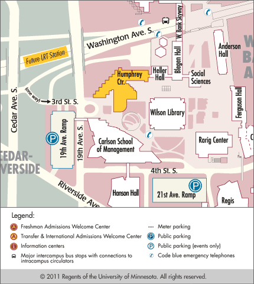

<h2>Seminar Information</h2>

<strong>November 1st, 2013</strong>

Humphrey Institute 
Cowles Auditorium 
University of Minnesota 
301 19th Ave. South 
Minneapolis, MN 55455

<a href="http://maps.google.com/maps?f=q&source=s_q&hl=en&geocode=&q=301+19th+Avenue+S,+Minneapolis,+MN+55455&sll=44.973133,-93.245868&sspn=0.007711,0.019248&ie=UTF8&hq=&hnear=301+19th+Ave+S,+Minneapolis,+Hennepin,+Minnesota+55455&ll=44.971645,-93.245709&spn=0.007712,0.019248&z=16" target="_blank"> Humphrey Center - Click for Directions</a>

### Program Agenda



### Course Faculty



### Educational Objectives

At the conclusion of the conference, participants should be able to: 

1. Explain changes in methodology and practice that are taking place in cytogenetics. 

2. Recognize opportunities provided by use of next generation sequencing, as well as develop understanding of challenges presented by that testing. 

3. Understand current and emerging use of molecular techniques in multiple organ systems, including the thyroid, breast cancer, hematolymphoid system, neuropathology, soft tissue pathology, and infectious disease. 

4. Recognize the major molecular alterations that characterize human tumors. 

5. Identify a key protein mutation in brain tumors that can be detected via immunohistochemistry. 

6. Recognize how a mutation in a gene can result in an abnormal localization of the corresponding protein. 

7. Recognize how different alterations in a gene can result in the same final common pathway of loss of protein expression. 

8. Understand how immunohistochemistry can be employed to detect chromosomal translocations that are specific for certain malignancies, e.g. alveolar soft part sarcoma. 

9. Recognize how immnohistochemistry can be integrated with fluorescence in situ hybridation to detect the presence of ALK alterations in lung adenocarcinoma.

### Statement of Need

This symposium will present recent advances in the field of molecular pathology. The presentation will emphasize the need for an interdisciplinary approach to diagnosis and treatment, and will focus on recently described entities, diagnostic criteria, differential diagnosis and the impact of our diagnosis on prognosis and therapeutic procedures. 

### Accreditation

#### AMA Credit Designation Statement

This activity has been planned and implemented in accordance with the Essential Areas and Policies of the Accreditation Council for Continuing Medical Education through the joint sponsorship of the Minnesota Medical Association and Minnesota Society of Pathologists. 

The Minnesota Medical Association (MMA) is accredited by the Accreditation Council for Continuing Medical Education to provide continuing medical education for physicians. 

The Minnesota Medical Association designates this live event for a maximum of **11.25** _AMA PRA Category 1 Credit(s)™_. Physicians should claim only the credit commensurate with the extent of their participation in the activity. 

#### Nurse Practitioner, Nurses, and Other Health Care Professionals 

Nurse practitioners, nurses, and other health care professionals who participate in this CME activity may submit their Statements of Attendance to their appropriate accrediting organizations or state boards for consideration of credit. 

The participant is responsible for determining whether this activity meets the requirements for acceptable continuing education. 

#### American Academy of Physician Assistants 

AAPA accepts AMA Category 1 CME credits for the PRA from organizations accredited by the ACCME. 

 
### Disclaimer

The content of this CME activity does not necessarily reflect the view or policies of the Minnesota Medical Association.